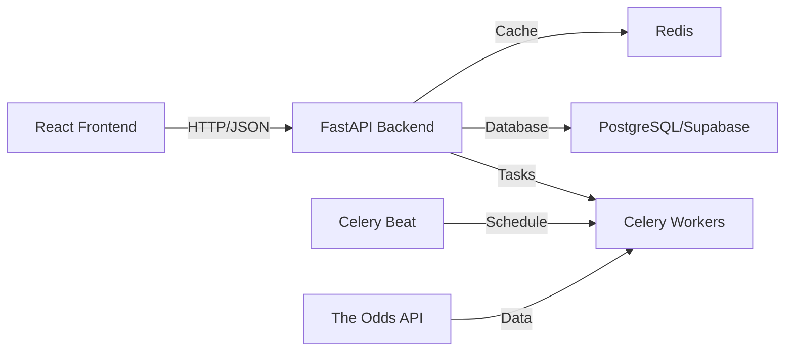

# FairEdge Development & Deployment Guide

Complete guide for developing and deploying the FairEdge sports betting platform, from local development to production deployment.

## 🚀 Quick Start

### Prerequisites
- **Docker & Docker Compose** (recommended)
- **Python 3.11+** with pip (for local development)
- **Node.js 18+** with npm (for local development)
- **Git** for version control

### Instant Setup (Recommended)
```bash
# Clone repository
git clone https://github.com/your-org/fairedge.git
cd fairedge

# Setup environment
cp .env.example .env.development
# Edit .env.development with your configuration

# Start everything with Docker
./scripts/deploy.sh development

# Access your application
# Frontend: http://localhost:5173
# Backend API: http://localhost:8000
# API Docs: http://localhost:8000/docs
```

## 🏗️ Architecture Overview

### System Components


### Monorepo Structure
```
fairedge/
├── 📁 docker/                    # All Docker configurations
│   ├── Dockerfile.backend        # Multi-stage backend (API + Celery)
│   ├── Dockerfile.frontend       # Production React + Nginx
│   ├── Dockerfile.dev            # Development containers
│   ├── entrypoints/              # Service startup scripts
│   ├── nginx/                    # Nginx configuration
│   └── redis/                    # Redis configuration
├── 📁 frontend/                  # React application
│   ├── src/                      # React source code
│   ├── public/                   # Static assets
│   ├── package.json              # Frontend dependencies
│   └── vite.config.ts            # Build configuration
├── 📁 backend/                   # FastAPI application
│   ├── app.py                    # Main FastAPI application
│   ├── core/                     # Core utilities and configuration
│   ├── services/                 # Business logic services
│   ├── routes/                   # API route modules
│   ├── models.py                 # Database models
│   └── utils/                    # Shared utilities
├── 📁 docs/                      # Documentation
├── 📁 scripts/                   # Deployment and utility scripts
├── 📁 tests/                     # Test suite
├── .env.development              # Development configuration
├── .env.production               # Production configuration
├── .env.example                  # Configuration template
├── docker-compose.yml            # Development orchestration
├── docker-compose.prod.yml       # Production orchestration
└── requirements.txt              # Python dependencies
```

## 🔧 Environment Configuration

### Consolidated Environment Management

**Single Source of Truth**: All configuration (backend + frontend) is managed from root-level files:

- **`.env.development`** - Development settings
- **`.env.production`** - Production settings  
- **`.env.example`** - Template for setup

### Environment Variables Structure

#### Backend Variables
```bash
# Application
ENVIRONMENT=development
DEBUG_MODE=true

# Database & Auth (Supabase)
SUPABASE_URL=https://your-project.supabase.co
SUPABASE_ANON_KEY=your_anon_key
SUPABASE_JWT_SECRET=your_jwt_secret
SUPABASE_SERVICE_ROLE_KEY=your_service_role_key
DB_CONNECTION_STRING=postgresql+asyncpg://...

# External APIs
ODDS_API_KEY=your_odds_api_key

# Redis Cache & Tasks
REDIS_URL=redis://localhost:6379/0
REFRESH_INTERVAL_MINUTES=5

# Stripe Payments
STRIPE_SECRET_KEY=sk_test_...
STRIPE_WEBHOOK_SECRET=whsec_...
STRIPE_BASIC_PRICE=price_...
STRIPE_PREMIUM_PRICE=price_...

# Security
ADMIN_SECRET=your_secure_admin_secret
CORS_ORIGINS=http://localhost:5173,http://localhost:3000
```

#### Frontend Variables (VITE_* prefix)
```bash
# Frontend Configuration (exposed to browser)
VITE_API_URL=http://localhost:8000
VITE_SUPABASE_URL=https://your-project.supabase.co
VITE_SUPABASE_ANON_KEY=your_anon_key
VITE_APP_TITLE=FairEdge Sports Betting
VITE_APP_VERSION=1.0.0
VITE_ENABLE_DEV_TOOLS=true
VITE_ENABLE_ANALYTICS=false
```

### Setup Instructions
```bash
# 1. Copy environment template
cp .env.example .env.development

# 2. Configure your values (replace all CHANGE_ME values)
# - Update Supabase credentials
# - Add your Odds API key
# - Configure Stripe keys (test keys for development)

# 3. For production deployment
cp .env.example .env.production
# Update with production values and live API keys
```

## 🐳 Development Environments

### Docker Development (Recommended)

**Benefits**: Consistent environment, no local dependencies, easy setup

```bash
# Start full development environment
./scripts/deploy.sh development

# Alternative: Direct Docker Compose
docker-compose up -d

# View logs
./scripts/deploy.sh logs development

# Stop services
./scripts/deploy.sh stop
```

**Services Started**:
- **Frontend**: Vite dev server with hot reload (port 5173)
- **Backend**: FastAPI with auto-reload (port 8000)
- **Celery Worker**: Background task processing
- **Celery Beat**: Task scheduler
- **Redis**: Cache and message broker (port 6379)

### Local Development (Alternative)

**Benefits**: Direct debugging, faster iteration for specific components

```bash
# Backend services
pip install -r requirements.txt

# Terminal 1: Redis
redis-server

# Terminal 2: Celery Worker
celery -A services.celery_app.celery_app worker --loglevel=info

# Terminal 3: Celery Beat (scheduler)
celery -A services.celery_app.celery_app beat --loglevel=info

# Terminal 4: FastAPI server
uvicorn app:app --reload --port 8000

# Frontend (separate terminal)
cd frontend
npm install
npm run dev
```

## 🧪 Testing

### Running Tests
```bash
# All tests via script
./scripts/run_tests.sh smoke      # Quick health checks
./scripts/run_tests.sh integration # Full test suite
./scripts/run_tests.sh load       # Performance testing

# Manual testing
pytest tests/ -v                  # Python tests
cd frontend && npm test           # Frontend tests

# Docker-based testing
docker-compose -f docker-compose.test.yml up --abort-on-container-exit
```

### Test Structure
- **Smoke Tests**: Basic health checks and API connectivity
- **Integration Tests**: End-to-end API workflows and data processing
- **Load Tests**: Performance benchmarks using Locust
- **Frontend Tests**: React component and integration tests

## 🔄 Development Workflow

### Daily Development
```bash
# Start development environment
./scripts/deploy.sh development

# Make changes to code
# - Backend: Auto-reload enabled
# - Frontend: Hot module replacement

# Run tests before committing
./scripts/run_tests.sh smoke

# View logs for debugging
./scripts/deploy.sh logs development
docker-compose logs -f api        # Specific service logs
```

### Database Migrations
```bash
# Generate new migration
alembic revision --autogenerate -m "description"

# Apply migrations
alembic upgrade head

# Downgrade if needed
alembic downgrade -1
```

### Code Quality Standards

#### Python (Backend)
- **Formatter**: Black
- **Linting**: Flake8
- **Type Hints**: Required for new functions
- **Docstrings**: Google style

```python
def calculate_ev(fair_probability: float, decimal_odds: float) -> float:
    """Calculate expected value percentage.
    
    Args:
        fair_probability: True win probability (0.0 to 1.0)
        decimal_odds: Market odds in decimal format
        
    Returns:
        EV as decimal (e.g., 0.045 = 4.5% EV)
    """
    return (fair_probability * decimal_odds) - 1
```

#### TypeScript (Frontend)
- **Formatter**: Prettier
- **Linting**: ESLint
- **Type Safety**: Strict mode enabled

```typescript
interface BettingOpportunity {
  id: string;
  event: string;
  evPercentage: number;
  bestOdds: string;
  bookmaker: string;
}
```

## 🚀 Production Deployment

### Docker Production Stack

**Architecture**: Multi-container production setup with monitoring

```bash
# Deploy to production
./scripts/deploy.sh production

# With monitoring (Prometheus + Grafana)
./scripts/deploy.sh production --monitoring

# Alternative: Direct Docker Compose
docker-compose -f docker-compose.prod.yml up -d
```

**Production Services**:
- **Frontend**: Nginx serving optimized React build (port 80/443)
- **Backend**: Gunicorn + Uvicorn workers (port 8000)
- **Celery**: Optimized worker processes with resource limits
- **Redis**: Production-tuned configuration
- **Monitoring**: Prometheus (port 9090) + Grafana (port 3000)

### Production Docker Images

#### Backend Image (`docker/Dockerfile.backend`)
- **Base**: Python 3.11-slim
- **Multi-stage**: Builder + Production
- **Features**: Non-root user, optimized packages, health checks
- **Services**: API, Celery Worker, Celery Beat (configurable entrypoints)

#### Frontend Image (`docker/Dockerfile.frontend`)
- **Base**: Node 18 + Nginx Alpine
- **Multi-stage**: Builder + Production
- **Features**: Optimized React build, security headers, caching

#### Development Image (`docker/Dockerfile.dev`)
- **Multi-target**: Backend-dev + Frontend-dev
- **Features**: Hot reload, development tools, shared configuration

### Environment-Specific Configuration

#### Development
```bash
ENVIRONMENT=development
DEBUG_MODE=true
CORS_ORIGINS=http://localhost:5173,http://localhost:3000
VITE_API_URL=http://localhost:8000
VITE_ENABLE_DEV_TOOLS=true
```

#### Production
```bash
ENVIRONMENT=production
DEBUG_MODE=false
CORS_ORIGINS=https://yourdomain.com,https://www.yourdomain.com
VITE_API_URL=https://api.yourdomain.com
VITE_ENABLE_DEV_TOOLS=false
VITE_ENABLE_ANALYTICS=true
```

## 📊 Monitoring & Observability

### Health Checks
All services include comprehensive health monitoring:
- **API**: `/health` endpoint with dependency checks
- **Frontend**: Nginx status endpoint
- **Celery Worker**: Celery inspect ping
- **Redis**: Redis ping command

### Monitoring Stack (Optional)
```bash
# Start with monitoring
./scripts/deploy.sh production --monitoring

# Access monitoring tools
# Prometheus: http://localhost:9090
# Grafana: http://localhost:3000 (admin/admin)
```

**Metrics Collected**:
- API performance and response times
- Celery task metrics and queue sizes
- Redis performance and memory usage
- System metrics (CPU, memory, disk)

### Logging
```bash
# View all logs
./scripts/deploy.sh logs production

# Service-specific logs
docker-compose logs -f api
docker-compose logs -f celery_worker
docker-compose logs -f frontend

# Log files (mounted volumes)
tail -f logs/api/*.log
tail -f logs/celery/*.log
tail -f logs/nginx/*.log
```

## 🔧 Troubleshooting

### Common Development Issues

#### Services Won't Start
```bash
# Check Docker status
docker --version
docker-compose --version

# Check port availability
netstat -tulpn | grep :8000
netstat -tulpn | grep :5173

# Reset everything
./scripts/deploy.sh clean
./scripts/deploy.sh development
```

#### Environment Variable Issues
```bash
# Check environment loading
./scripts/deploy.sh status development

# Verify frontend can read root env
cd frontend && npm run dev

# Check Docker environment passing
docker-compose exec frontend env | grep VITE_
docker-compose exec api env | grep SUPABASE_
```

#### Database Connection Issues
```bash
# Test Supabase connection
python -c "
import asyncpg
import asyncio
async def test(): 
    conn = await asyncpg.connect('${DB_CONNECTION_STRING}')
    await conn.close()
    print('DB connection OK')
asyncio.run(test())
"
```

#### Redis Connection Issues
```bash
# Test Redis connectivity
redis-cli -u ${REDIS_URL} ping

# Check Redis in Docker
docker-compose exec redis redis-cli ping

# Clear Redis cache if needed
redis-cli -u ${REDIS_URL} FLUSHALL
```

#### Celery Task Issues
```bash
# Check worker status
docker-compose exec celery_worker celery -A services.celery_app.celery_app inspect active

# Check scheduled tasks
docker-compose exec celery_beat celery -A services.celery_app.celery_app inspect scheduled

# Purge task queue
docker-compose exec celery_worker celery -A services.celery_app.celery_app purge
```

### Performance Optimization

#### Production Tuning
```bash
# Adjust worker processes based on CPU cores
WEB_CONCURRENCY=4               # API workers
CELERY_CONCURRENCY=4            # Celery workers
CELERY_MAX_TASKS_PER_CHILD=1000 # Worker recycling
CELERY_MAX_MEMORY_PER_CHILD=200000 # Memory limits
```

#### Resource Limits (docker-compose.prod.yml)
```yaml
deploy:
  resources:
    limits:
      memory: 1G
      cpus: '1.0'
    reservations:
      memory: 512M
      cpus: '0.5'
```

## 🔒 Security Best Practices

### Environment Security
- Never commit `.env.*` files with real credentials
- Use different secrets for each environment
- Rotate JWT secrets and API keys regularly
- Enable Redis authentication in production

### Container Security
- Non-root user execution
- Minimal base images
- Multi-stage builds (smaller attack surface)
- Network isolation between services

### Application Security
- CORS configuration for allowed origins
- Security headers via Nginx
- Input validation and sanitization
- Rate limiting on API endpoints

## 🔄 Maintenance & Updates

### Regular Maintenance
```bash
# Update base images
docker pull python:3.11-slim
docker pull node:18-alpine
docker pull nginx:1.25-alpine
docker pull redis:7-alpine

# Rebuild with latest dependencies
./scripts/deploy.sh production --clean

# Clean up old images
docker system prune -af
```

### Backup Procedures
```bash
# Backup Redis data
docker-compose exec redis redis-cli BGSAVE

# Backup application data
docker run --rm -v fairedge-prod_redis_data:/data -v $(pwd):/backup alpine tar czf /backup/redis-backup.tar.gz -C /data .
```

## 🚀 Deployment Commands Reference

### Development
```bash
./scripts/deploy.sh development    # Start dev environment
./scripts/deploy.sh logs development # View logs
./scripts/deploy.sh status development # Check status
```

### Production
```bash
./scripts/deploy.sh production     # Deploy to production
./scripts/deploy.sh production --monitoring # With monitoring
./scripts/deploy.sh logs production # View production logs
./scripts/deploy.sh stop          # Stop all services
./scripts/deploy.sh clean         # Clean up everything
```

### Manual Docker Compose
```bash
# Development
docker-compose up -d
docker-compose down --remove-orphans

# Production  
docker-compose -f docker-compose.prod.yml up -d
docker-compose -f docker-compose.prod.yml down --remove-orphans
```

## 🤝 Contributing

### Pull Request Process
1. **Branch**: `git checkout -b feature/description`
2. **Develop**: Make changes with proper testing
3. **Test**: `./scripts/run_tests.sh smoke`
4. **Commit**: Use conventional commit messages
5. **PR**: Create pull request with clear description

### Code Quality Checklist
- [ ] Code follows style guidelines (Black, Prettier)
- [ ] All tests pass locally
- [ ] Environment variables documented
- [ ] No hardcoded secrets or credentials
- [ ] Error handling implemented
- [ ] Documentation updated

---

## 📚 Additional Resources

- **API Documentation**: http://localhost:8000/docs (when running)
- **Frontend Development**: React + TypeScript + Vite
- **Backend Development**: FastAPI + SQLAlchemy + Celery
- **Database**: Supabase (PostgreSQL) with auth
- **Deployment**: Docker + Docker Compose

**Need Help?**
- Check system status: `./scripts/deploy.sh status`
- View comprehensive logs: `./scripts/deploy.sh logs development`
- Run diagnostics: `python scripts/test_setup.py` 